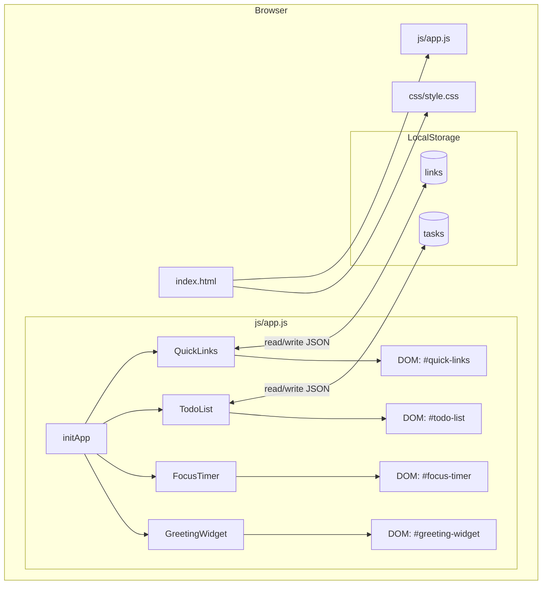
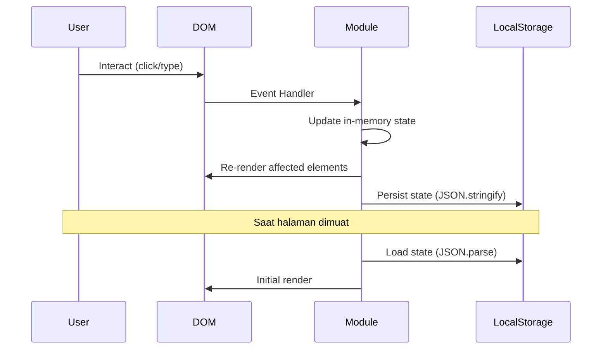

# Design Document: Todo List Life Dashboard

## Overview

Todo List Life Dashboard adalah aplikasi web single-page (SPA) yang berjalan sepenuhnya di browser tanpa backend. Aplikasi ini menggabungkan empat komponen fungsional dalam satu halaman: **Greeting Widget** (waktu & salam), **Focus Timer** (Pomodoro countdown), **Todo List** (manajemen tugas), dan **Quick Links** (akses cepat situs favorit).

Semua persistensi data menggunakan **Local Storage API** bawaan browser. Teknologi yang digunakan adalah HTML5, CSS3, dan Vanilla JavaScript (ES6+) murni — tidak ada framework atau dependensi eksternal. File statis ini dapat langsung dibuka di browser tanpa proses build.

**Keputusan desain utama:**
- Vanilla JS dipilih atas framework (React, Vue) karena lingkup fitur sederhana, tidak ada dependensi build, dan mudah dijalankan sebagai file statis.
- Module pattern (IIFE/closure) digunakan per komponen untuk menghindari polusi namespace global.
- Satu file JS tunggal digunakan sesuai Requirement 5.1, dengan organisasi internal berbasis modul logis.

---

## Architecture

### Diagram Arsitektur



### Pola Arsitektur

Aplikasi menggunakan **Event-Driven Single Responsibility Pattern**:

- Setiap komponen adalah objek JavaScript mandiri dengan metode `init()`, `render()`, dan handler spesifiknya.
- Komponen tidak saling berkomunikasi langsung — mereka hanya berinteraksi dengan DOM dan Local Storage.
- State komponen disimpan dalam closure masing-masing modul.
- Tidak ada state global terpusat (cukup sederhana untuk lingkup ini).

### Alur Data



---

## Components and Interfaces

### 1. GreetingWidget

**Tanggung jawab:** Menampilkan waktu HH:MM:SS, tanggal lengkap, dan pesan salam berbasis Time_Of_Day.

```
GreetingWidget
├── init()              → Mulai interval 1 detik, render pertama
├── tick()              → Dipanggil tiap detik oleh setInterval
├── getTimeOfDay(hour)  → Mengembalikan string kategori waktu
├── getGreetingMessage(timeOfDay) → Mengembalikan string salam + emoji
├── formatTime(date)    → "HH:MM:SS"
├── formatDate(date)    → "Jumat, 18 Juli 2025"
└── render(data)        → Update DOM elemen waktu, tanggal, salam
```

**DOM Elements:**
- `#greeting-time` — tampilan jam
- `#greeting-date` — tampilan tanggal
- `#greeting-message` — teks salam

**Time_Of_Day Logic:**
| Jam | Kategori | Pesan |
|-----|----------|-------|
| 05–11 | Pagi | "Selamat Pagi! ☀️" |
| 12–14 | Siang | "Selamat Siang! 🌤️" |
| 15–17 | Sore | "Selamat Sore! 🌅" |
| 18–04 | Malam | "Selamat Malam! 🌙" |

---

### 2. FocusTimer

**Tanggung jawab:** Timer Pomodoro hitung mundur 25:00 dengan kontrol Start/Stop/Reset.

```
FocusTimer
├── init()              → Setup DOM, bind event listeners
├── start()             → Mulai setInterval 1 detik
├── stop()              → clearInterval, simpan sisa waktu
├── reset()             → clearInterval, set ke 25:00
├── tick()              → Kurangi 1 detik, cek 00:00
├── notifyComplete()    → Tampilkan notifikasi (alert/custom modal)
├── formatDisplay(secs) → "MM:SS" dari total detik
└── render()            → Update DOM #timer-display
```

**DOM Elements:**
- `#timer-display` — tampilan MM:SS
- `#timer-start` — tombol Start
- `#timer-stop` — tombol Stop
- `#timer-reset` — tombol Reset

**State Internal:**
- `totalSeconds: number` — sisa waktu dalam detik (awal: 1500)
- `intervalId: number | null` — ID dari setInterval aktif
- `isRunning: boolean`

---

### 3. TodoList

**Tanggung jawab:** CRUD tugas lengkap dengan persistensi Local Storage.

```
TodoList
├── init()                  → Load dari LS, render
├── loadFromStorage()       → JSON.parse tasks dari LS
├── saveToStorage()         → JSON.stringify tasks ke LS
├── addTask(text)           → Tambah task baru, save, render
├── deleteTask(id)          → Hapus task by id, save, render
├── toggleTask(id)          → Toggle status completed, save, render
├── startEdit(id)           → Aktifkan mode inline edit
├── confirmEdit(id, text)   → Simpan teks baru, save, render
├── cancelEdit(id)          → Batalkan edit, render
├── validateInput(text)     → Return false jika kosong/whitespace
├── generateId()            → Timestamp-based unique ID
└── render()                → Re-render seluruh #task-list dari state
```

**DOM Elements:**
- `#task-input` — input field teks tugas
- `#task-add-btn` — tombol Tambah
- `#task-list` — container ul/div untuk daftar task
  - Per task: checkbox, teks (atau input saat edit), tombol Edit, tombol Hapus

**Local Storage Key:** `'dashboard_tasks'`

---

### 4. QuickLinks

**Tanggung jawab:** Manajemen link favorit dengan validasi dan persistensi.

```
QuickLinks
├── init()                  → Load dari LS, render
├── loadFromStorage()       → JSON.parse links dari LS
├── saveToStorage()         → JSON.stringify links ke LS
├── addLink(label, url)     → Tambah link baru, save, render
├── deleteLink(id)          → Hapus link by id, save, render
├── validateLabel(label)    → Return false jika kosong
├── validateUrl(url)        → Return false jika tidak ada http:// atau https://
├── normalizeUrl(url)       → Tambah https:// jika tidak ada protokol (opsional helper)
├── generateId()            → Timestamp-based unique ID
└── render()                → Re-render seluruh #links-container dari state
```

**DOM Elements:**
- `#link-label-input` — input field label
- `#link-url-input` — input field URL
- `#link-add-btn` — tombol Tambah Link
- `#links-container` — container untuk tombol-tombol link
  - Per link: tombol utama (buka URL), tombol hapus (×)

**Local Storage Key:** `'dashboard_links'`

---

### 5. StorageService (Utility)

Helper sederhana untuk enkapsulasi Local Storage operations:

```javascript
const StorageService = {
  get(key, fallback = []) {
    try {
      const data = localStorage.getItem(key);
      return data ? JSON.parse(data) : fallback;
    } catch {
      return fallback;
    }
  },
  set(key, value) {
    try {
      localStorage.setItem(key, JSON.stringify(value));
    } catch (e) {
      console.error('LocalStorage write failed:', e);
    }
  }
};
```

---

## Data Models

### Task

```javascript
/**
 * @typedef {Object} Task
 * @property {string} id          - Unique identifier (e.g., "task_1721234567890")
 * @property {string} text        - Deskripsi tugas (non-empty, trimmed)
 * @property {boolean} completed  - Status selesai/belum
 * @property {number} createdAt   - Unix timestamp saat dibuat
 */
```

**Contoh:**
```json
{
  "id": "task_1721234567890",
  "text": "Belajar property-based testing",
  "completed": false,
  "createdAt": 1721234567890
}
```

**Local Storage Format:** Array of Task, di-JSON.stringify ke key `'dashboard_tasks'`.

---

### Link

```javascript
/**
 * @typedef {Object} Link
 * @property {string} id        - Unique identifier (e.g., "link_1721234567891")
 * @property {string} label     - Teks tampilan tombol (non-empty, trimmed)
 * @property {string} url       - URL lengkap dengan protokol (http:// atau https://)
 * @property {number} createdAt - Unix timestamp saat dibuat
 */
```

**Contoh:**
```json
{
  "id": "link_1721234567891",
  "label": "GitHub",
  "url": "https://github.com",
  "createdAt": 1721234567891
}
```

**Local Storage Format:** Array of Link, di-JSON.stringify ke key `'dashboard_links'`.

---

### Local Storage Schema

```
localStorage
├── "dashboard_tasks"  → JSON string dari Task[]
└── "dashboard_links"  → JSON string dari Link[]
```

**Invariant:**
- `dashboard_tasks` selalu berupa array yang valid (atau tidak ada kunci sama sekali)
- `dashboard_links` selalu berupa array yang valid (atau tidak ada kunci sama sekali)
- Setiap `id` dalam array bersifat unik dalam koleksinya

---

## Correctness Properties

*A property is a characteristic or behavior that should hold true across all valid executions of a system — essentially, a formal statement about what the system should do. Properties serve as the bridge between human-readable specifications and machine-verifiable correctness guarantees.*

### Property 1: Penambahan task menambah panjang daftar

*For any* daftar task yang ada dan teks tugas yang valid (non-empty, non-whitespace-only), menambahkan task tersebut ke daftar harus menghasilkan panjang daftar bertambah tepat satu.

**Validates: Requirements 3.1**

---

### Property 2: Input whitespace ditolak

*For any* string yang terdiri seluruhnya dari karakter whitespace (spasi, tab, newline), mencoba menambahkan task dengan teks tersebut harus ditolak dan daftar task tidak boleh berubah.

**Validates: Requirements 3.2**

---

### Property 3: Round-trip persistensi task

*For any* daftar task yang valid, menyimpan daftar tersebut ke Local Storage kemudian memuatnya kembali harus menghasilkan daftar yang identik secara struktural (id, text, completed, createdAt sama).

**Validates: Requirements 3.8, 3.9**

---

### Property 4: Toggle status bersifat reversibel

*For any* task dalam daftar, melakukan toggle dua kali berturut-turut harus mengembalikan task ke status semula (completed tidak berubah dari nilai awal).

**Validates: Requirements 3.5, 3.6**

---

### Property 5: Hapus task mengurangi daftar

*For any* daftar task yang non-empty, menghapus satu task dengan id tertentu harus menghasilkan task dengan id tersebut tidak ada dalam daftar, dan panjang daftar berkurang tepat satu.

**Validates: Requirements 3.7**

---

### Property 6: URL link tanpa protokol valid ditolak

*For any* string URL yang tidak dimulai dengan `http://` atau `https://`, mencoba menambahkan link tersebut harus ditolak dan daftar link tidak boleh berubah.

**Validates: Requirements 4.2**

---

### Property 7: Round-trip persistensi link

*For any* daftar link yang valid, menyimpan daftar tersebut ke Local Storage kemudian memuatnya kembali harus menghasilkan daftar yang identik secara struktural (id, label, url, createdAt sama).

**Validates: Requirements 4.6, 4.7**

---

### Property 8: Salam sesuai dengan jam

*For any* nilai jam integer dalam rentang 0–23, fungsi `getGreetingMessage` harus mengembalikan pesan salam yang secara deterministik sesuai dengan kategori Time_Of_Day yang berlaku (Pagi untuk 5–11, Siang untuk 12–14, Sore untuk 15–17, Malam untuk 18–4).

**Validates: Requirements 1.3, 1.4, 1.5, 1.6**

---

### Property 9: Format waktu selalu valid

*For any* objek Date yang valid, fungsi `formatTime` harus menghasilkan string dengan format tepat "HH:MM:SS" di mana HH ∈ [00–23], MM ∈ [00–59], SS ∈ [00–59].

**Validates: Requirements 1.1**

---

### Property 10: Timer reset selalu ke 25:00

*For any* keadaan timer (berjalan maupun berhenti, berapapun sisa waktu), melakukan reset harus selalu mengembalikan `totalSeconds` ke 1500 dan `isRunning` ke false.

**Validates: Requirements 2.5**

---

## Error Handling

### Strategi Umum

Aplikasi berjalan sepenuhnya di client-side, sehingga error handling difokuskan pada:

1. **Input Validation** — tolak input tidak valid sebelum memproses
2. **Local Storage Errors** — tangani kuota penuh atau mode private browsing
3. **State Corruption** — gunakan fallback ke array kosong jika data LS corrupt

### Per Komponen

| Skenario | Penanganan |
|----------|-----------|
| Task input kosong/whitespace | Tampilkan pesan validasi inline di bawah input, tidak tambah task |
| Link label kosong | Tampilkan pesan validasi inline, tidak simpan |
| Link URL tidak ada protokol | Tampilkan pesan validasi inline, tidak simpan |
| `localStorage.getItem` return null | Gunakan fallback `[]` (array kosong) |
| `JSON.parse` gagal (data corrupt) | Catch error, reset ke `[]`, log ke console |
| `localStorage.setItem` gagal (QuotaExceededError) | Catch error, tampilkan console warning |
| Timer mencapai 00:00 | `clearInterval`, tampilkan `alert()` atau custom notification |
| Browser tidak support `localStorage` | Aplikasi tetap berjalan tanpa persistensi, data hilang saat refresh |

### Validasi Input Detail

```
Task input:
  - trim() terlebih dahulu
  - Jika string kosong setelah trim → invalid

Link label:
  - trim() terlebih dahulu  
  - Jika string kosong setelah trim → invalid

Link URL:
  - trim() terlebih dahulu
  - Jika tidak dimulai dengan "http://" atau "https://" → invalid
  - Regex check: /^https?:\/\/.+/
```

---

## Testing Strategy

### Pendekatan Pengujian

Karena aplikasi adalah Vanilla JS murni (pure functions + DOM manipulation), pendekatan testing yang digunakan adalah:

1. **Unit Tests** — menguji fungsi-fungsi pure (validasi, format, kalkulasi)
2. **Property-Based Tests** — menguji properti universal menggunakan [fast-check](https://github.com/dubzzz/fast-check) (TypeScript/JavaScript PBT library)
3. **Integration/Example Tests** — menguji interaksi antar komponen dengan JSDOM

**Library:**
- **Test runner**: [Vitest](https://vitest.dev/) (modern, fast, no config needed)
- **PBT library**: [fast-check](https://github.com/dubzzz/fast-check) — mature, widely used, runs in Node.js
- **DOM simulation**: JSDOM (built into Vitest environment)

### Konfigurasi Property-Based Tests

- Minimum **100 iterasi** per property test
- Setiap property test diberi tag komentar:
  ```javascript
  // Feature: todo-list-life-dashboard, Property 3: Round-trip persistensi task
  ```

### Mapping Properties ke Tests

| Property | Test File | Fungsi yang Diuji |
|----------|-----------|-------------------|
| P1: Penambahan task menambah panjang | `todo.test.js` | `TodoList.addTask()` |
| P2: Whitespace ditolak | `todo.test.js` | `TodoList.validateInput()` |
| P3: Round-trip persistensi task | `storage.test.js` | `StorageService.get/set` + `loadFromStorage` |
| P4: Toggle reversibel | `todo.test.js` | `TodoList.toggleTask()` |
| P5: Hapus task mengurangi daftar | `todo.test.js` | `TodoList.deleteTask()` |
| P6: URL tanpa protokol ditolak | `quicklinks.test.js` | `QuickLinks.validateUrl()` |
| P7: Round-trip persistensi link | `storage.test.js` | `StorageService.get/set` + `loadFromStorage` |
| P8: Salam sesuai jam | `greeting.test.js` | `GreetingWidget.getGreetingMessage()` |
| P9: Format waktu valid | `greeting.test.js` | `GreetingWidget.formatTime()` |
| P10: Timer reset ke 25:00 | `timer.test.js` | `FocusTimer.reset()` |

### Unit Tests (Contoh Spesifik)

```javascript
// Contoh: validasi URL
test('URL dengan http:// diterima', () => {
  expect(QuickLinks.validateUrl('http://example.com')).toBe(true);
});

test('URL dengan https:// diterima', () => {
  expect(QuickLinks.validateUrl('https://github.com')).toBe(true);
});

test('URL tanpa protokol ditolak', () => {
  expect(QuickLinks.validateUrl('github.com')).toBe(false);
  expect(QuickLinks.validateUrl('ftp://example.com')).toBe(false);
});
```

### Contoh Property-Based Test

```javascript
import fc from 'fast-check';
import { describe, it, expect } from 'vitest';

describe('TodoList', () => {
  it('P2: whitespace-only input selalu ditolak', () => {
    // Feature: todo-list-life-dashboard, Property 2: Input whitespace ditolak
    fc.assert(
      fc.property(
        fc.stringOf(fc.constantFrom(' ', '\t', '\n', '\r')),
        (whitespaceText) => {
          const result = TodoList.validateInput(whitespaceText);
          return result === false;
        }
      ),
      { numRuns: 100 }
    );
  });

  it('P3: round-trip persistensi task', () => {
    // Feature: todo-list-life-dashboard, Property 3: Round-trip persistensi task
    fc.assert(
      fc.property(
        fc.array(fc.record({
          id: fc.string({ minLength: 1 }),
          text: fc.string({ minLength: 1 }),
          completed: fc.boolean(),
          createdAt: fc.integer({ min: 0 })
        })),
        (tasks) => {
          StorageService.set('dashboard_tasks', tasks);
          const loaded = StorageService.get('dashboard_tasks');
          return JSON.stringify(loaded) === JSON.stringify(tasks);
        }
      ),
      { numRuns: 100 }
    );
  });
});
```

### Pengujian Visual & Responsivitas

- Verifikasi manual di Chrome, Firefox, Edge, Safari
- Cek responsivitas di lebar 768px (tablet) dan 1280px (desktop)
- Aksesibilitas: verifikasi `aria-label` pada tombol icon, ukuran klik ≥ 44×44px

### Cakupan Test yang Ditargetkan

- Semua pure functions: 100% coverage
- Semua 10 correctness properties: 1 property test per properti, min 100 iterasi
- Happy path per komponen: 1 unit test per fitur utama
- Error/edge cases: 1 unit test per skenario error kritis
